# Mwalimu Kazi — System Flowchart

Every algorithm the system runs, in the order it runs them, drawn from the
code rather than from intent: `packages/core` for the pure decisions,
`apps/mobile/lib` for the I/O around them, and `supabase/migrations` for the
rules Postgres enforces whatever the client does.

Read it top-down. Section 1 is the map; sections 2 onward are each surface's
algorithm in full.

**Legend**

| Shape | Meaning |
| --- | --- |
| Rectangle | A step of work — a function, a query, a render |
| Diamond | A branch the code actually tests |
| Rounded | An entry point or a terminal outcome |
| `[( )]` | A database table, bucket or queue |
| Dashed arrow | Crosses a trust boundary — client to database, or database to client |

---

## 1. System map

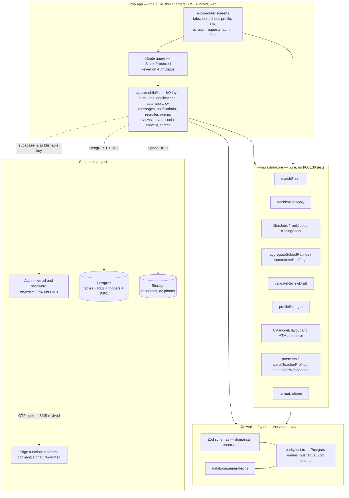
```mermaid
flowchart TD
  subgraph Client["Expo app — one build, three targets: iOS, Android, web"]
    Screens["expo-router screens<br/>tabs, job, school, profile, CV,<br/>recruiter, requests, admin, feed"]
    Guards["Route guard — Stack.Protected<br/>keyed on AuthStatus"]
    Lib["apps/mobile/lib — I/O layer<br/>auth, jobs, applications, auto-apply, cv,<br/>messages, notifications, recruiter, admin,<br/>reviews, saved, social, content, career"]
  end

  subgraph Core["@mwalimu/core — pure, no I/O, 136 tests"]
    Match["matchScore"]
    Auto["decideAutoApply"]
    Query["filterJobs / rankJobs / closingSoon"]
    Reviews["aggregateSchoolRatings / summariseRedFlags"]
    Draft["validateReviewDraft"]
    Strength["profileStrength"]
    Cv["CV model, layout and HTML renderer"]
    Mappers["parseJob / parseTeacherProfile / parseJobsWithSchools"]
    Format["format, phone"]
  end

  subgraph Types["@mwalimu/types — the vocabulary"]
    Zod["Zod schemas — domain.ts, enums.ts"]
    Gen["database.generated.ts"]
    Parity["parity.test.ts — Postgres enums must equal Zod enums"]
  end

  subgraph Supa["Supabase project"]
    Auth["Auth — email and password,<br/>recovery links, sessions"]
    PG[("Postgres<br/>tables + RLS + triggers + RPC")]
    Store[("Storage<br/>resources, cv-photos")]
    Fn["Edge function send-sms<br/>dormant; signature-verified"]
  end

  Screens --> Guards
  Guards --> Lib
  Screens --> Core
  Lib --> Core
  Core --> Types
  Lib --> Types
  Lib -.->|"supabase-js, publishable key"| Auth
  Lib -.->|"PostgREST + RPC"| PG
  Lib -.->|"signed URLs"| Store
  Auth -.->|"OTP hook, if SMS revived"| Fn
  Zod --- Parity
  Gen --- Parity
```

The invariant the map encodes: **no decision is made twice.** A teacher's job
card and a recruiter's candidate row both call `matchScore`; nothing
reimplements it in SQL. Access control is not duplicated in the client either —
RLS is the layer, and the client's queries carry no owner filters because the
database applies them.

---

## 2. Cold start and the auth state machine

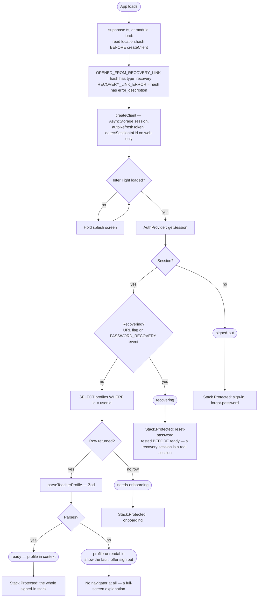
```mermaid
flowchart TD
  Boot(["App loads"]) --> URL["supabase.ts, at module load:<br/>read location.hash BEFORE createClient"]
  URL --> Flags["OPENED_FROM_RECOVERY_LINK = hash has type=recovery<br/>RECOVERY_LINK_ERROR = hash has error_description"]
  Flags --> MakeClient["createClient — AsyncStorage session,<br/>autoRefreshToken, detectSessionInUrl on web only"]
  MakeClient --> Fonts{"Inter Tight loaded?"}
  Fonts -->|"no"| Splash["Hold splash screen"]
  Splash --> Fonts
  Fonts -->|"yes"| Provider["AuthProvider: getSession"]

  Provider --> HasSession{"Session?"}
  HasSession -->|"no"| SignedOut(["signed-out"])
  HasSession -->|"yes"| Recover{"Recovering?<br/>URL flag or PASSWORD_RECOVERY event"}
  Recover -->|"yes"| Recovering(["recovering"])
  Recover -->|"no"| Load["SELECT profiles WHERE id = user.id"]

  Load --> Row{"Row returned?"}
  Row -->|"no row"| Onboard(["needs-onboarding"])
  Row -->|"yes"| Parse["parseTeacherProfile — Zod"]
  Parse --> Ok{"Parses?"}
  Ok -->|"yes"| Ready(["ready — profile in context"])
  Ok -->|"no"| Broken(["profile-unreadable<br/>show the fault, offer sign out"])

  SignedOut --> R1["Stack.Protected: sign-in, forgot-password"]
  Recovering --> R2["Stack.Protected: reset-password<br/>tested BEFORE ready — a recovery session is a real session"]
  Onboard --> R3["Stack.Protected: onboarding"]
  Ready --> R4["Stack.Protected: the whole signed-in stack"]
  Broken --> R5["No navigator at all — a full-screen explanation"]
```

Three decisions worth naming:

- **The URL is read before the client is constructed.** `detectSessionInUrl`
  consumes the fragment during `createClient`, before React can subscribe, so a
  provider waiting on the `PASSWORD_RECOVERY` event would miss it on web.
- **`recovering` is tested ahead of the profile checks**, so a reset link
  reaches the reset screen whether or not onboarding was ever finished.
- **`refreshProfile` does not clear `profileResolved`.** Dropping status to
  `loading` unmounts the guarded stack and throws the teacher back to Home —
  which is what every profile save used to do.

---

## 3. Credentials: sign in, sign up, reset

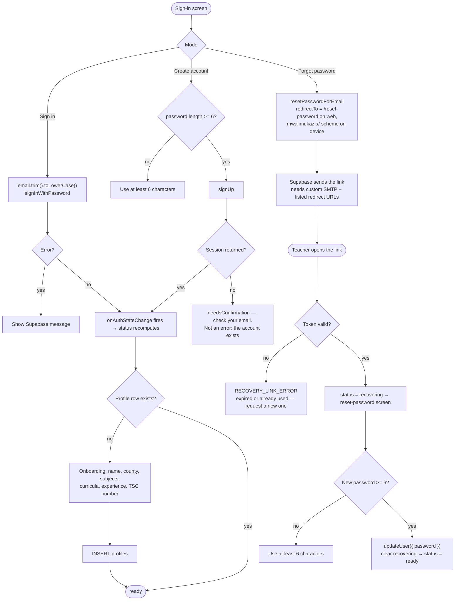
```mermaid
flowchart TD
  In(["Sign-in screen"]) --> Mode{"Mode"}

  Mode -->|"Sign in"| SI["email.trim().toLowerCase()<br/>signInWithPassword"]
  SI --> SIok{"Error?"}
  SIok -->|"yes"| SIerr["Show Supabase message"]
  SIok -->|"no"| Session["onAuthStateChange fires → status recomputes"]

  Mode -->|"Create account"| SU{"password.length >= 6?"}
  SU -->|"no"| SUshort["Use at least 6 characters"]
  SU -->|"yes"| SUgo["signUp"]
  SUgo --> SUsess{"Session returned?"}
  SUsess -->|"yes"| Session
  SUsess -->|"no"| Confirm["needsConfirmation — check your email.<br/>Not an error: the account exists"]

  Mode -->|"Forgot password"| FP["resetPasswordForEmail<br/>redirectTo = /reset-password on web,<br/>mwalimukazi:// scheme on device"]
  FP --> Mail["Supabase sends the link<br/>needs custom SMTP + listed redirect URLs"]
  Mail --> Click(["Teacher opens the link"])
  Click --> Valid{"Token valid?"}
  Valid -->|"no"| Expired["RECOVERY_LINK_ERROR<br/>expired or already used — request a new one"]
  Valid -->|"yes"| Recovering["status = recovering → reset-password screen"]
  Recovering --> NewPw{"New password >= 6?"}
  NewPw -->|"no"| PwShort["Use at least 6 characters"]
  NewPw -->|"yes"| Update["updateUser({ password })<br/>clear recovering → status = ready"]

  Session --> Profile{"Profile row exists?"}
  Profile -->|"no"| Onboarding["Onboarding: name, county, subjects,<br/>curricula, experience, TSC number"]
  Onboarding --> Insert["INSERT profiles"] --> Ready(["ready"])
  Profile -->|"yes"| Ready
```

---

## 4. Job discovery — fetch, parse, filter, rank

```mermaid
flowchart TD
  Open(["Jobs tab / Home / Saved"]) --> Fetch["fetchOpenJobs:<br/>SELECT JOB_SELECT FROM jobs<br/>WHERE published<br/>ORDER BY posted_at DESC LIMIT 100"]
  Fetch -.->|"RLS jobs_select_visible"| DB[("jobs ⋈ schools")]
  DB -.-> Rows["Rows with the embedded school:<br/>name, slug, school_type, curricula, verification"]

  Rows --> Parse["parseJobsWithSchools"]
  Parse --> PerRow{"Row parses?<br/>requirements validated STRICTLY"}
  PerRow -->|"no"| Skip["Push a reason onto skipped[]<br/>Row is dropped, never half-rendered"]
  PerRow -->|"yes"| Good["JobWithSchool"]
  Skip --> Banner["Screen shows the skipped count —<br/>bad data is visible, not silent"]

  Good --> Filter["filterJobs — the teacher's explicit instructions"]
  Filter --> F1{"subjects overlap?"}
  F1 --> F2{"county in list?"}
  F2 --> F3{"jobType in list?"}
  F3 --> F4{"engagement in list?"}
  F4 --> F5{"meetsOnline / meetsAtStudent required?"}
  F5 --> F6{"schoolType matches?<br/>a listing with no school is EXCLUDED"}
  F6 --> F7{"school curricula overlap?"}
  F7 --> F8{"salary ceiling >= minSalary?<br/>no advertised salary is KEPT — browsing is reversible"}
  F8 --> F9{"required experience &lt;= maxExperienceYears?"}
  F9 --> F10{"tscOnly and job requires TSC?"}
  F10 --> F11{"query matches title, school or subject?"}
  F11 --> Kept["Kept set"]

  Kept --> Rank["rankJobs — our opinion about order,<br/>never a second filter on what they asked for"]
  Rank --> S1["1. matchScore DESC"]
  S1 --> S2["2. closesAt ASC — a closing role beats a fresh one"]
  S2 --> S3["3. postedAt DESC"]
  S3 --> Drop["Finally: drop anything already closed"]
  Drop --> Render(["Ranked job cards, each with its own breakdown"])
```

### 4a. Infinite scroll uses a keyset, not an offset

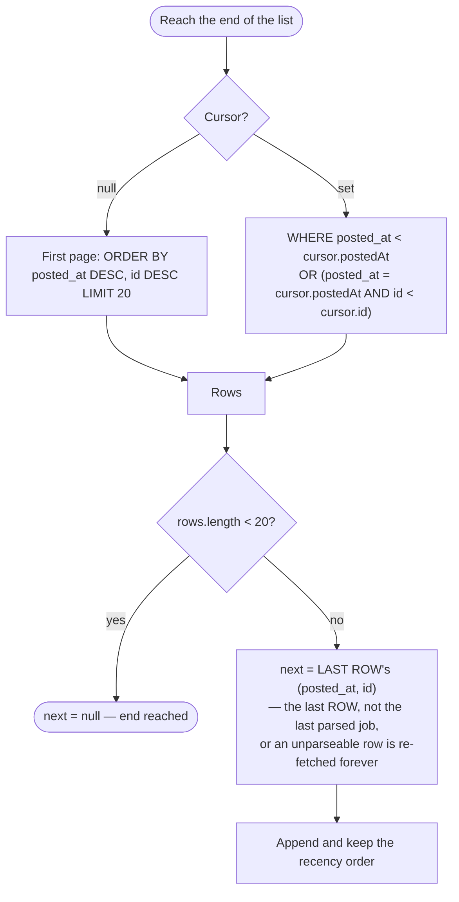
```mermaid
flowchart TD
  Scroll(["Reach the end of the list"]) --> Cur{"Cursor?"}
  Cur -->|"null"| P1["First page: ORDER BY posted_at DESC, id DESC LIMIT 20"]
  Cur -->|"set"| P2["WHERE posted_at &lt; cursor.postedAt<br/>OR (posted_at = cursor.postedAt AND id &lt; cursor.id)"]
  P1 --> Got["Rows"]
  P2 --> Got
  Got --> Next{"rows.length &lt; 20?"}
  Next -->|"yes"| End(["next = null — end reached"])
  Next -->|"no"| Cursor["next = LAST ROW's (posted_at, id)<br/>— the last ROW, not the last parsed job,<br/>or an unparseable row is re-fetched forever"]
  Cursor --> Append["Append and keep the recency order"]
```

Paging is ordered by recency and not by match, deliberately: a client-side
ranking can only order what it has loaded, so a match-ordered infinite list
would reshuffle as you scroll. Home's "Top matches" does the real ranking over
a bounded recent window instead.

---

## 5. `matchScore` — the number both sides see

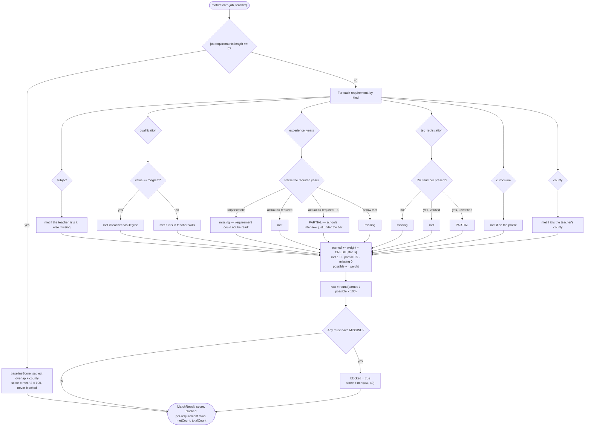
```mermaid
flowchart TD
  Call(["matchScore(job, teacher)"]) --> Any{"job.requirements.length == 0?"}

  Any -->|"yes"| Base["baselineScore: subject overlap + county<br/>score = met / 2 × 100, never blocked"]
  Base --> Out

  Any -->|"no"| Loop["For each requirement, by kind"]

  Loop --> K1{"subject"}
  K1 --> R1["met if the teacher lists it, else missing"]

  Loop --> K2{"qualification"}
  K2 --> R2{"value == 'degree'?"}
  R2 -->|"yes"| R2a["met if teacher.hasDegree"]
  R2 -->|"no"| R2b["met if it is in teacher.skills"]

  Loop --> K3{"experience_years"}
  K3 --> R3{"Parse the required years"}
  R3 -->|"unparseable"| R3x["missing — 'requirement could not be read'"]
  R3 -->|"actual >= required"| R3a["met"]
  R3 -->|"actual >= required − 1"| R3b["PARTIAL — schools interview just under the bar"]
  R3 -->|"below that"| R3c["missing"]

  Loop --> K4{"tsc_registration"}
  K4 --> R4{"TSC number present?"}
  R4 -->|"no"| R4a["missing"]
  R4 -->|"yes, verified"| R4b["met"]
  R4 -->|"yes, unverified"| R4c["PARTIAL"]

  Loop --> K5{"curriculum"}
  K5 --> R5["met if on the profile"]

  Loop --> K6{"county"}
  K6 --> R6["met if it is the teacher's county"]

  R1 --> Weigh
  R2a --> Weigh
  R2b --> Weigh
  R3x --> Weigh
  R3a --> Weigh
  R3b --> Weigh
  R3c --> Weigh
  R4a --> Weigh
  R4b --> Weigh
  R4c --> Weigh
  R5 --> Weigh
  R6 --> Weigh

  Weigh["earned += weight × CREDIT[status]<br/>met 1.0 · partial 0.5 · missing 0<br/>possible += weight"] --> Raw["raw = round(earned / possible × 100)"]
  Raw --> Block{"Any must-have MISSING?"}
  Block -->|"no"| Out["score = raw"]
  Block -->|"yes"| Cap["blocked = true<br/>score = min(raw, 49)"]
  Cap --> Out
  Out(["MatchResult: score, blocked,<br/>per-requirement rows, metCount, totalCount"])
```

`MUST_HAVE_FAIL_CAP = 49` is load-bearing: Auto-Apply's `minMatchScore` floors
at 50, so a failed hard requirement can never be auto-applied past however
strong the rest of the profile is.

---

## 6. Reading a vacancy and applying by hand

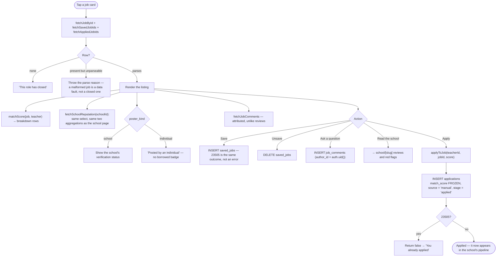
```mermaid
flowchart TD
  Card(["Tap a job card"]) --> Load["fetchJobById + fetchSavedJobIds + fetchAppliedJobIds"]
  Load --> Exists{"Row?"}
  Exists -->|"none"| Gone["'This role has closed'"]
  Exists -->|"present but unparseable"| Fault["Throw the parse reason —<br/>a malformed job is a data fault, not a closed one"]
  Exists -->|"parses"| Show["Render the listing"]

  Show --> Score["matchScore(job, teacher) → breakdown rows"]
  Show --> Rep["fetchSchoolReputation(schoolId):<br/>same select, same two aggregations as the school page"]
  Show --> Prov{"poster_kind"}
  Prov -->|"school"| Verified["Show the school's verification status"]
  Prov -->|"individual"| Person["'Posted by an individual' — no borrowed badge"]
  Show --> Comments["fetchJobComments — attributed, unlike reviews"]

  Show --> Act{"Action"}
  Act -->|"Save"| Save["INSERT saved_jobs — 23505 is the same outcome, not an error"]
  Act -->|"Unsave"| Unsave["DELETE saved_jobs"]
  Act -->|"Ask a question"| AddC["INSERT job_comments (author_id = auth.uid())"]
  Act -->|"Read the school"| School["→ school/[slug] reviews and red flags"]
  Act -->|"Apply"| Apply["applyToJob(teacherId, jobId, score)"]

  Apply --> Ins["INSERT applications<br/>match_score FROZEN, source = 'manual', stage = 'applied'"]
  Ins --> Dup{"23505?"}
  Dup -->|"yes"| Already["Return false → 'You already applied'"]
  Dup -->|"no"| Done(["Applied — it now appears in the school's pipeline"])
```

The frozen `match_score` is the deliberate opposite of the notification path:
an application is a record of what the school received and must not move under
them; a notification is a prompt and is scored live.

---

## 7. Auto-Apply — the run

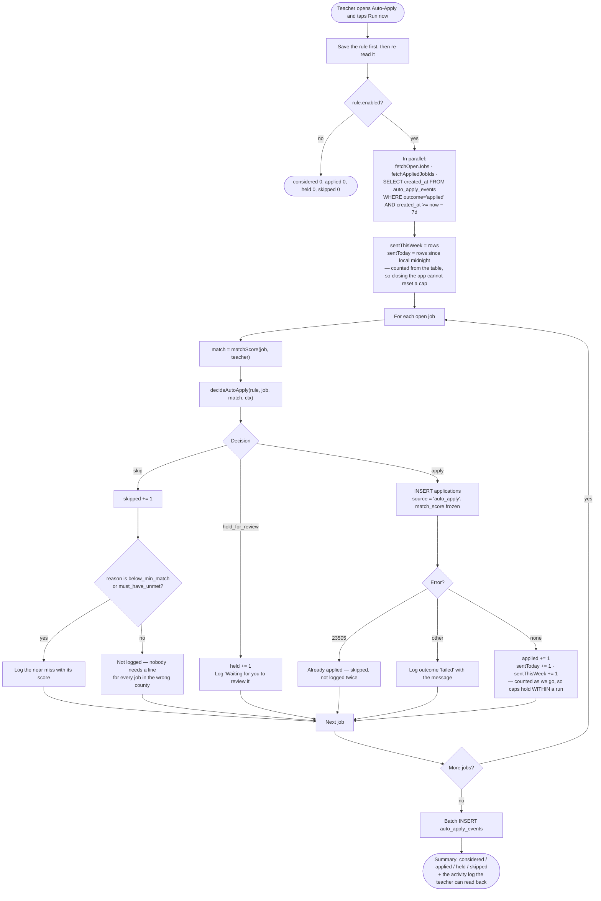
```mermaid
flowchart TD
  Start(["Teacher opens Auto-Apply and taps Run now"]) --> Persist["Save the rule first, then re-read it"]
  Persist --> Enabled{"rule.enabled?"}
  Enabled -->|"no"| Zero(["considered 0, applied 0, held 0, skipped 0"])
  Enabled -->|"yes"| Gather["In parallel:<br/>fetchOpenJobs · fetchAppliedJobIds ·<br/>SELECT created_at FROM auto_apply_events<br/>WHERE outcome='applied' AND created_at >= now − 7d"]

  Gather --> Counts["sentThisWeek = rows<br/>sentToday = rows since local midnight<br/>— counted from the table, so closing the app cannot reset a cap"]
  Counts --> Each["For each open job"]
  Each --> Sc["match = matchScore(job, teacher)"]
  Sc --> Decide["decideAutoApply(rule, job, match, ctx)"]

  Decide --> D{"Decision"}
  D -->|"skip"| Sk["skipped += 1"]
  Sk --> LogIt{"reason is below_min_match<br/>or must_have_unmet?"}
  LogIt -->|"yes"| Ev1["Log the near miss with its score"]
  LogIt -->|"no"| Quiet["Not logged — nobody needs a line<br/>for every job in the wrong county"]

  D -->|"hold_for_review"| Hd["held += 1<br/>Log 'Waiting for you to review it'"]

  D -->|"apply"| Send["INSERT applications<br/>source = 'auto_apply', match_score frozen"]
  Send --> Err{"Error?"}
  Err -->|"23505"| Dup["Already applied — skipped, not logged twice"]
  Err -->|"other"| Fail["Log outcome 'failed' with the message"]
  Err -->|"none"| Sent["applied += 1<br/>sentToday += 1 · sentThisWeek += 1<br/>— counted as we go, so caps hold WITHIN a run"]

  Ev1 --> Next
  Quiet --> Next
  Hd --> Next
  Dup --> Next
  Fail --> Next
  Sent --> Next["Next job"]
  Next --> More{"More jobs?"}
  More -->|"yes"| Each
  More -->|"no"| Flush["Batch INSERT auto_apply_events"]
  Flush --> Sum(["Summary: considered / applied / held / skipped<br/>+ the activity log the teacher can read back"])
```

The runner is the client, on purpose. `decideAutoApply` is the most
consequential function in the codebase, and a second copy of it in SQL or an
Edge Function is the one drift this system cannot afford — so the cost is paid
where it is visible: it evaluates when the teacher opens the app, and the
screen says so plainly.

### 7a. `decideAutoApply` — the gate ladder

Gates run cheapest-and-most-decisive first, so the logged reason is the useful
one rather than an incidental later failure.

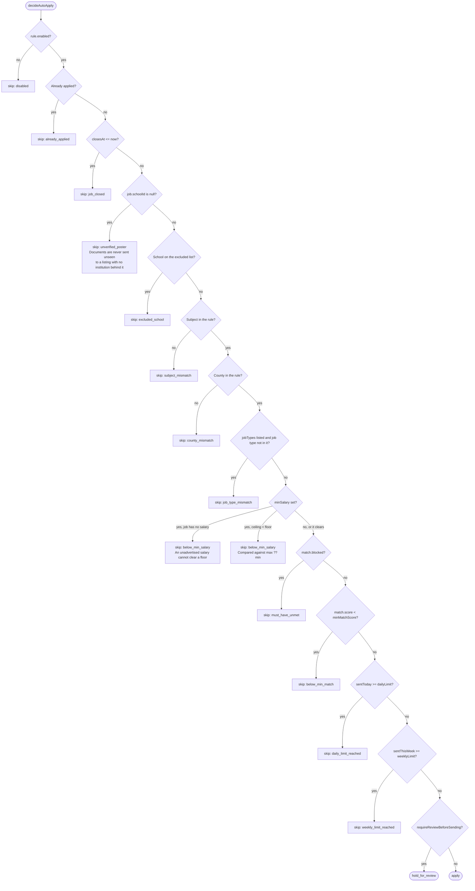
```mermaid
flowchart TD
  G0(["decideAutoApply"]) --> G1{"rule.enabled?"}
  G1 -->|"no"| S1["skip: disabled"]
  G1 -->|"yes"| G2{"Already applied?"}
  G2 -->|"yes"| S2["skip: already_applied"]
  G2 -->|"no"| G3{"closesAt &lt;= now?"}
  G3 -->|"yes"| S3["skip: job_closed"]
  G3 -->|"no"| G4{"job.schoolId is null?"}
  G4 -->|"yes"| S4["skip: unverified_poster<br/>Documents are never sent unseen<br/>to a listing with no institution behind it"]
  G4 -->|"no"| G5{"School on the excluded list?"}
  G5 -->|"yes"| S5["skip: excluded_school"]
  G5 -->|"no"| G6{"Subject in the rule?"}
  G6 -->|"no"| S6["skip: subject_mismatch"]
  G6 -->|"yes"| G7{"County in the rule?"}
  G7 -->|"no"| S7["skip: county_mismatch"]
  G7 -->|"yes"| G8{"jobTypes listed and job type not in it?"}
  G8 -->|"yes"| S8["skip: job_type_mismatch"]
  G8 -->|"no"| G9{"minSalary set?"}
  G9 -->|"yes, job has no salary"| S9a["skip: below_min_salary<br/>An unadvertised salary cannot clear a floor"]
  G9 -->|"yes, ceiling &lt; floor"| S9b["skip: below_min_salary<br/>Compared against max ?? min"]
  G9 -->|"no, or it clears"| G10{"match.blocked?"}
  G10 -->|"yes"| S10["skip: must_have_unmet"]
  G10 -->|"no"| G11{"match.score &lt; minMatchScore?"}
  G11 -->|"yes"| S11["skip: below_min_match"]
  G11 -->|"no"| G12{"sentToday >= dailyLimit?"}
  G12 -->|"yes"| S12["skip: daily_limit_reached"]
  G12 -->|"no"| G13{"sentThisWeek >= weeklyLimit?"}
  G13 -->|"yes"| S13["skip: weekly_limit_reached"]
  G13 -->|"no"| G14{"requireReviewBeforeSending?"}
  G14 -->|"yes"| Hold(["hold_for_review"])
  G14 -->|"no"| Apply(["apply"])
```

Every skip carries a `SkipReason`, and every reason has human wording in
`SKIP_REASON_TEXT`. A teacher who cannot see why they were passed over will not
trust the feature.

---

## 8. Posting a listing — school vacancy or private request

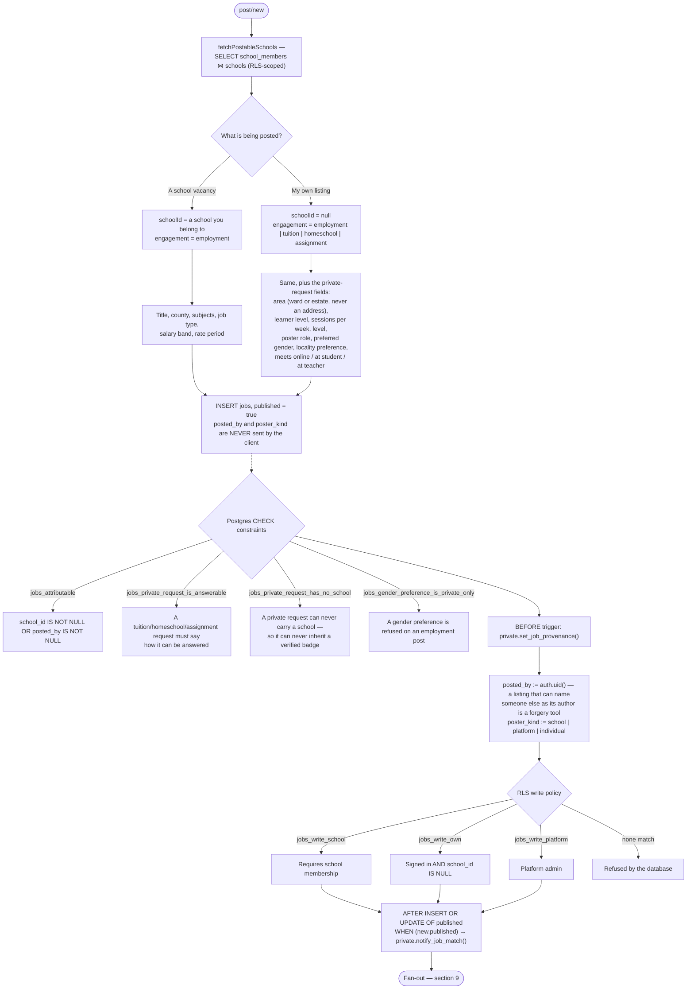
```mermaid
flowchart TD
  New(["post/new"]) --> Who["fetchPostableSchools —<br/>SELECT school_members ⋈ schools (RLS-scoped)"]
  Who --> Kind{"What is being posted?"}

  Kind -->|"A school vacancy"| Sch["schoolId = a school you belong to<br/>engagement = employment"]
  Kind -->|"My own listing"| Ind["schoolId = null<br/>engagement = employment | tuition | homeschool | assignment"]

  Sch --> Form["Title, county, subjects, job type,<br/>salary band, rate period"]
  Ind --> Form2["Same, plus the private-request fields:<br/>area (ward or estate, never an address),<br/>learner level, sessions per week, level,<br/>poster role, preferred gender, locality preference,<br/>meets online / at student / at teacher"]

  Form --> Insert
  Form2 --> Insert["INSERT jobs, published = true<br/>posted_by and poster_kind are NEVER sent by the client"]

  Insert -.-> Checks{"Postgres CHECK constraints"}
  Checks -->|"jobs_attributable"| C1["school_id IS NOT NULL OR posted_by IS NOT NULL"]
  Checks -->|"jobs_private_request_is_answerable"| C2["A tuition/homeschool/assignment request must say<br/>how it can be answered"]
  Checks -->|"jobs_private_request_has_no_school"| C3["A private request can never carry a school —<br/>so it can never inherit a verified badge"]
  Checks -->|"jobs_gender_preference_is_private_only"| C4["A gender preference is refused on an employment post"]

  Checks --> Before["BEFORE trigger: private.set_job_provenance()"]
  Before --> Prov["posted_by := auth.uid() — a listing that can name<br/>someone else as its author is a forgery tool<br/>poster_kind := school | platform | individual"]

  Prov --> RLS{"RLS write policy"}
  RLS -->|"jobs_write_school"| W1["Requires school membership"]
  RLS -->|"jobs_write_own"| W2["Signed in AND school_id IS NULL"]
  RLS -->|"jobs_write_platform"| W3["Platform admin"]
  RLS -->|"none match"| Refuse["Refused by the database"]

  W1 --> After
  W2 --> After
  W3 --> After
  After["AFTER INSERT OR UPDATE OF published<br/>WHEN (new.published) → private.notify_job_match()"] --> Fan(["Fan-out — section 9"])
```

---

## 9. Notification fan-out on publish

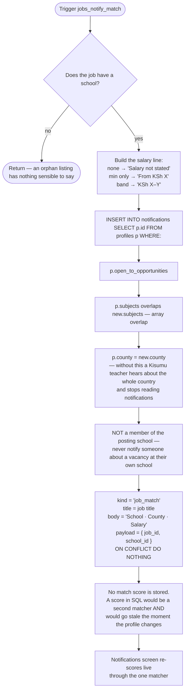
```mermaid
flowchart TD
  T(["Trigger jobs_notify_match"]) --> S{"Does the job have a school?"}
  S -->|"no"| Stop(["Return — an orphan listing has nothing sensible to say"])
  S -->|"yes"| Salary["Build the salary line:<br/>none → 'Salary not stated'<br/>min only → 'From KSh X'<br/>band → 'KSh X–Y'"]
  Salary --> Pick["INSERT INTO notifications SELECT p.id FROM profiles p WHERE:"]
  Pick --> P1["p.open_to_opportunities"]
  P1 --> P2["p.subjects overlaps new.subjects — array overlap"]
  P2 --> P3["p.county = new.county<br/>— without this a Kisumu teacher hears about the whole country<br/>and stops reading notifications"]
  P3 --> P4["NOT a member of the posting school —<br/>never notify someone about a vacancy at their own school"]
  P4 --> Ins["kind = 'job_match'<br/>title = job title<br/>body = 'School · County · Salary'<br/>payload = { job_id, school_id }<br/>ON CONFLICT DO NOTHING"]
  Ins --> NoScore["No match score is stored.<br/>A score in SQL would be a second matcher AND<br/>would go stale the moment the profile changes"]
  NoScore --> Client["Notifications screen re-scores live<br/>through the one matcher"]
```

### 9a. Reading the notification feed

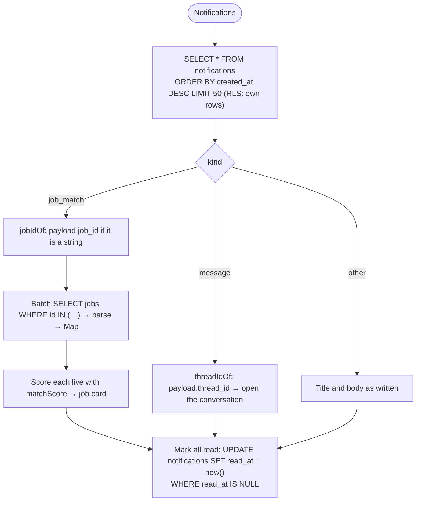
```mermaid
flowchart TD
  Open(["Notifications"]) --> Q["SELECT * FROM notifications<br/>ORDER BY created_at DESC LIMIT 50 (RLS: own rows)"]
  Q --> Kinds{"kind"}
  Kinds -->|job_match| J["jobIdOf: payload.job_id if it is a string"]
  J --> Resolve["Batch SELECT jobs WHERE id IN (…) → parse → Map"]
  Resolve --> Live["Score each live with matchScore → job card"]
  Kinds -->|"message"| M["threadIdOf: payload.thread_id → open the conversation"]
  Kinds -->|"other"| O["Title and body as written"]
  Live --> Mark
  M --> Mark
  O --> Mark["Mark all read: UPDATE notifications SET read_at = now()<br/>WHERE read_at IS NULL"]
```

---

## 10. The hiring side

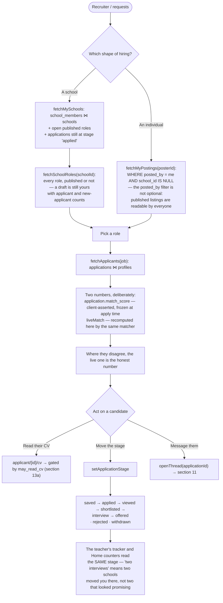
```mermaid
flowchart TD
  Entry(["Recruiter / requests"]) --> Two{"Which shape of hiring?"}

  Two -->|"A school"| MySchools["fetchMySchools: school_members ⋈ schools<br/>+ open published roles<br/>+ applications still at stage 'applied'"]
  MySchools --> Roles["fetchSchoolRoles(schoolId):<br/>every role, published or not — a draft is still yours<br/>with applicant and new-applicant counts"]
  Roles --> Job["Pick a role"]

  Two -->|"An individual"| Mine["fetchMyPostings(posterId):<br/>WHERE posted_by = me AND school_id IS NULL<br/>— the posted_by filter is not optional:<br/>published listings are readable by everyone"]
  Mine --> Job

  Job --> Apps["fetchApplicants(job): applications ⋈ profiles"]
  Apps --> TwoScores["Two numbers, deliberately:<br/>application.match_score — client-asserted, frozen at apply time<br/>liveMatch — recomputed here by the same matcher"]
  TwoScores --> Rank["Where they disagree, the live one is the honest number"]

  Rank --> Do{"Act on a candidate"}
  Do -->|"Read their CV"| Cv["applicant/[id]/cv → gated by may_read_cv (section 13a)"]
  Do -->|"Move the stage"| Stage["setApplicationStage"]
  Do -->|"Message them"| Thread["openThread(applicationId) → section 11"]

  Stage --> Pipeline["saved → applied → viewed → shortlisted →<br/>interview → offered<br/>· rejected · withdrawn"]
  Pipeline --> Teacher["The teacher's tracker and Home counters read<br/>the SAME stage — 'two interviews' means two schools<br/>moved you there, not two that looked promising"]
```

Membership of a school is a fact about a person, not a different login: a head
of department is often also a teacher looking for their next role.

---

## 11. Messaging — anchored to an application, never to a pair of people

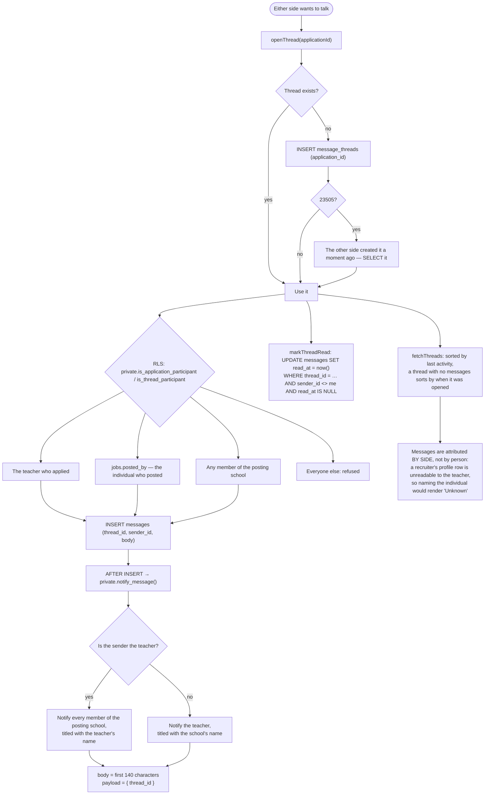
```mermaid
flowchart TD
  Want(["Either side wants to talk"]) --> Open["openThread(applicationId)"]
  Open --> Ex{"Thread exists?"}
  Ex -->|"yes"| Use["Use it"]
  Ex -->|"no"| Create["INSERT message_threads (application_id)"]
  Create --> Race{"23505?"}
  Race -->|"yes"| Refetch["The other side created it a moment ago — SELECT it"]
  Race -->|"no"| Use
  Refetch --> Use

  Use --> Gate{"RLS: private.is_application_participant / is_thread_participant"}
  Gate --> A["The teacher who applied"]
  Gate --> B["jobs.posted_by — the individual who posted"]
  Gate --> C["Any member of the posting school"]
  Gate --> D["Everyone else: refused"]

  A --> Send
  B --> Send
  C --> Send
  Send["INSERT messages (thread_id, sender_id, body)"] --> Trig["AFTER INSERT → private.notify_message()"]
  Trig --> Side{"Is the sender the teacher?"}
  Side -->|"yes"| ToSchool["Notify every member of the posting school,<br/>titled with the teacher's name"]
  Side -->|"no"| ToTeacher["Notify the teacher,<br/>titled with the school's name"]
  ToSchool --> Body
  ToTeacher --> Body["body = first 140 characters<br/>payload = { thread_id }"]

  Use --> Read["markThreadRead: UPDATE messages SET read_at = now()<br/>WHERE thread_id = … AND sender_id &lt;&gt; me AND read_at IS NULL"]
  Use --> List["fetchThreads: sorted by last activity,<br/>a thread with no messages sorts by when it was opened"]
  List --> Naming["Messages are attributed BY SIDE, not by person:<br/>a recruiter's profile row is unreadable to the teacher,<br/>so naming the individual would render 'Unknown'"]
```

Because a thread hangs off an application, there is no way to open a channel to
someone who has not chosen you. That is the whole safety model.

---

## 12. Reviews, red flags and a school's reputation

```mermaid
flowchart TD
  Write(["review/new"]) --> Draft["Compose: role title, body,<br/>1–10 category ratings, up to 4 red flags"]
  Draft --> Validate["validateReviewDraft — returns ALL problems at once,<br/>not the first, so submit is not a guessing game"]
  Validate --> V1{"At least one rating?"}
  V1 --> V2{"Every score a whole number 1–5?"}
  V2 --> V3{"No category rated twice?<br/>(review_id, category) is the primary key"}
  V3 --> V4{"Body between 40 and 4000 characters?"}
  V4 --> V5{"At most 4 red flags, each kind once?"}
  V5 --> V6{"Every red flag reason 40–1000 characters?<br/>Evidence is required — free text accusations<br/>are what make a review system defamatory"}
  V6 -->|"problems"| Fix["Show each one against its field"]
  V6 -->|"clean"| Rpc["RPC submit_school_review — ONE transaction"]

  Rpc -.-> Tx["INSERT school_reviews (author_id = auth.uid())<br/>+ INSERT review_ratings<br/>+ INSERT review_red_flags"]
  Tx --> Dup{"23505?"}
  Dup -->|"yes"| One["AlreadyReviewedError — one review per school per author"]
  Dup -->|"no"| Pending["moderation = 'pending'"]

  Pending --> Guard["Trigger school_reviews_guard_moderation:<br/>an author changing their own moderation status is refused"]
  Guard --> Queue[("Moderation queue")]
  Queue --> Mod{"Moderator decides"}
  Mod -->|"approved"| Live["Visible to everyone"]
  Mod -->|"rejected"| Dead["Visible only to its author"]

  Live --> Agg["Aggregation — one select, four surfaces"]
  Agg --> O1["overall = mean of each REVIEW's own average,<br/>NOT the mean of every rating — otherwise a reviewer who<br/>scored ten categories outweighs three who scored three"]
  Agg --> O2["byCategory: averaged only over reviews that rated it —<br/>a blank is absent, not a zero. Sorted WORST FIRST:<br/>the reason a teacher opens this screen is to find the problems"]
  Agg --> O3["summariseRedFlags: flags within 12 months, commonest first.<br/>Dated by when the incident happened, else when it was filed.<br/>Old flags age out — a school that fixed payroll two years ago<br/>should not carry it forever"]

  O1 --> Surfaces
  O2 --> Surfaces
  O3 --> Surfaces["Schools directory row · school page ·<br/>reviews list · reputation summary on the vacancy"]
```

Reviews are anonymous and comments are attributed. That asymmetry is
deliberate: asking a public question about a vacancy is a normal act, naming a
bad employer under your own name is not safe.

---

## 13. The CV

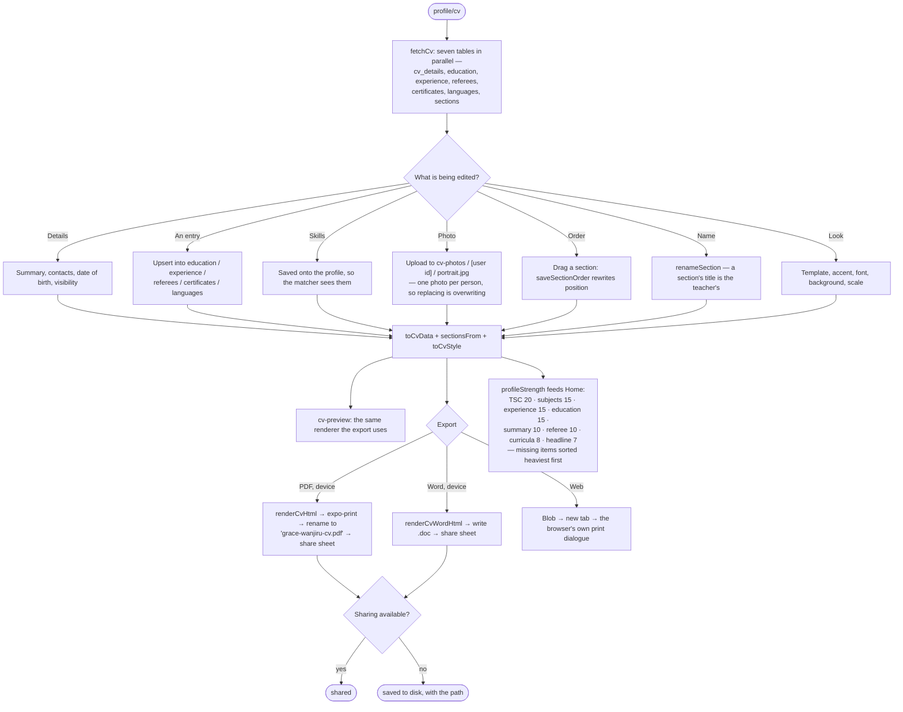
```mermaid
flowchart TD
  Cv(["profile/cv"]) --> Fetch["fetchCv: seven tables in parallel —<br/>cv_details, education, experience, referees,<br/>certificates, languages, sections"]
  Fetch --> Edit{"What is being edited?"}

  Edit -->|"Details"| D["Summary, contacts, date of birth, visibility"]
  Edit -->|"An entry"| E["Upsert into education / experience /<br/>referees / certificates / languages"]
  Edit -->|"Skills"| Sk["Saved onto the profile, so the matcher sees them"]
  Edit -->|"Photo"| Ph["Upload to cv-photos / [user id] / portrait.jpg<br/>— one photo per person, so replacing is overwriting"]
  Edit -->|"Order"| Ord["Drag a section: saveSectionOrder rewrites position"]
  Edit -->|"Name"| Ren["renameSection — a section's title is the teacher's"]
  Edit -->|"Look"| St["Template, accent, font, background, scale"]

  D --> Build
  E --> Build
  Sk --> Build
  Ph --> Build
  Ord --> Build
  Ren --> Build
  St --> Build["toCvData + sectionsFrom + toCvStyle"]

  Build --> Prev["cv-preview: the same renderer the export uses"]
  Build --> Exp{"Export"}
  Exp -->|"PDF, device"| Pdf["renderCvHtml → expo-print → rename to<br/>'grace-wanjiru-cv.pdf' → share sheet"]
  Exp -->|"Word, device"| Doc["renderCvWordHtml → write .doc → share sheet"]
  Exp -->|"Web"| Web["Blob → new tab → the browser's own print dialogue"]
  Pdf --> Res{"Sharing available?"}
  Res -->|"yes"| Shared(["shared"])
  Res -->|"no"| Saved(["saved to disk, with the path"])
  Doc --> Res

  Build --> Strength["profileStrength feeds Home:<br/>TSC 20 · subjects 15 · experience 15 · education 15 ·<br/>summary 10 · referee 10 · curricula 8 · headline 7<br/>— missing items sorted heaviest first"]
```

Both formats come from the one renderer, so the PDF and the Word file can never
show different things.

### 13a. Who may read a CV

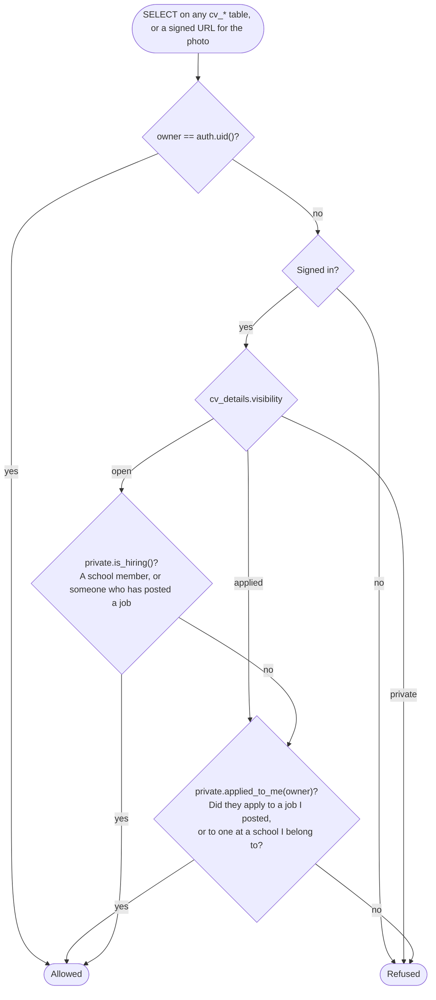
```mermaid
flowchart TD
  Ask(["SELECT on any cv_* table, or a signed URL for the photo"]) --> Own{"owner == auth.uid()?"}
  Own -->|"yes"| Yes(["Allowed"])
  Own -->|"no"| Anon{"Signed in?"}
  Anon -->|"no"| No(["Refused"])
  Anon -->|"yes"| Vis{"cv_details.visibility"}
  Vis -->|"private"| No
  Vis -->|"applied"| App{"private.applied_to_me(owner)?<br/>Did they apply to a job I posted,<br/>or to one at a school I belong to?"}
  App -->|"yes"| Yes
  App -->|"no"| No
  Vis -->|"open"| Hire{"private.is_hiring()?<br/>A school member, or someone who has posted a job"}
  Hire -->|"yes"| Yes
  Hire -->|"no"| App
```

The photo is fetched through a **short-lived signed URL and inlined as a
`data:` URI**, never linked: `download()` hits a stable per-object URL that
Cloudflare cached, and a recruiter kept seeing a portrait after the teacher made
their CV private. Signing produces a fresh URL every time, so every fetch is a
cache miss and revocation is immediate.

---

## 14. Home — what a teacher sees first

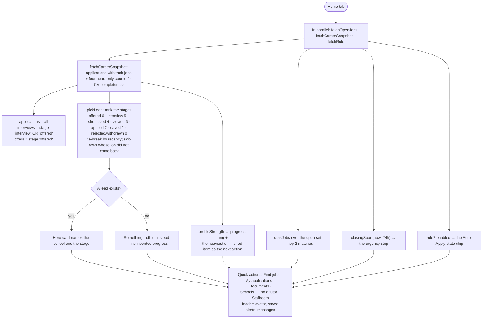
```mermaid
flowchart TD
  Home(["Home tab"]) --> Par["In parallel: fetchOpenJobs ·<br/>fetchCareerSnapshot · fetchRule"]
  Par --> Snap["fetchCareerSnapshot: applications with their jobs,<br/>+ four head-only counts for CV completeness"]
  Snap --> Counts["applications = all<br/>interviews = stage 'interview' OR 'offered'<br/>offers = stage 'offered'"]
  Snap --> Lead["pickLead: rank the stages<br/>offered 6 · interview 5 · shortlisted 4 · viewed 3 ·<br/>applied 2 · saved 1 · rejected/withdrawn 0<br/>tie-break by recency; skip rows whose job did not come back"]
  Lead --> Hero{"A lead exists?"}
  Hero -->|"yes"| HeroCard["Hero card names the school and the stage"]
  Hero -->|"no"| Empty["Something truthful instead — no invented progress"]

  Par --> Rank["rankJobs over the open set → top 2 matches"]
  Par --> Soon["closingSoon(now, 24h) → the urgency strip"]
  Par --> Auto["rule?.enabled → the Auto-Apply state chip"]

  Snap --> Ring["profileStrength → progress ring +<br/>the heaviest unfinished item as the next action"]

  HeroCard --> Grid
  Empty --> Grid
  Rank --> Grid
  Soon --> Grid
  Ring --> Grid
  Auto --> Grid["Quick actions: Find jobs · My applications · Documents ·<br/>Schools · Find a tutor · Staffroom<br/>Header: avatar, saved, alerts, messages"]
```

Every route without a tab has to appear in the grid or the header, or it is
unreachable.

---

## 15. Staffroom — the teacher feed

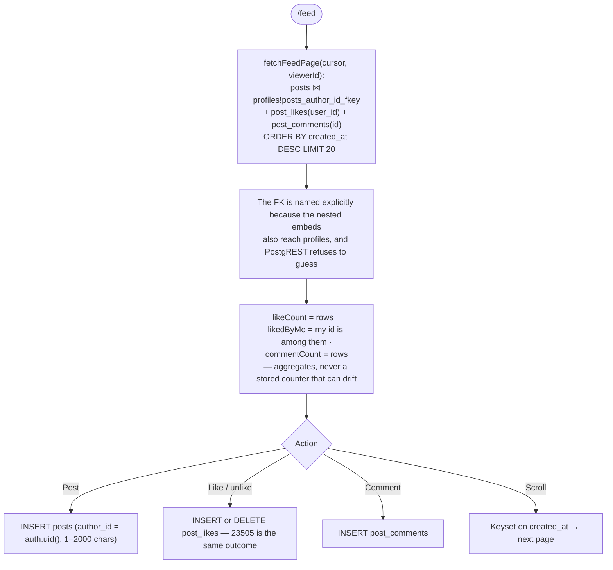
```mermaid
flowchart TD
  Feed(["/feed"]) --> Page["fetchFeedPage(cursor, viewerId):<br/>posts ⋈ profiles!posts_author_id_fkey<br/>+ post_likes(user_id) + post_comments(id)<br/>ORDER BY created_at DESC LIMIT 20"]
  Page --> Why["The FK is named explicitly because the nested embeds<br/>also reach profiles, and PostgREST refuses to guess"]
  Why --> Derive["likeCount = rows · likedByMe = my id is among them ·<br/>commentCount = rows<br/>— aggregates, never a stored counter that can drift"]
  Derive --> Acts{"Action"}
  Acts -->|"Post"| P["INSERT posts (author_id = auth.uid(), 1–2000 chars)"]
  Acts -->|"Like / unlike"| L["INSERT or DELETE post_likes — 23505 is the same outcome"]
  Acts -->|"Comment"| C["INSERT post_comments"]
  Acts -->|"Scroll"| N["Keyset on created_at → next page"]
```

---

## 16. News and the resource library

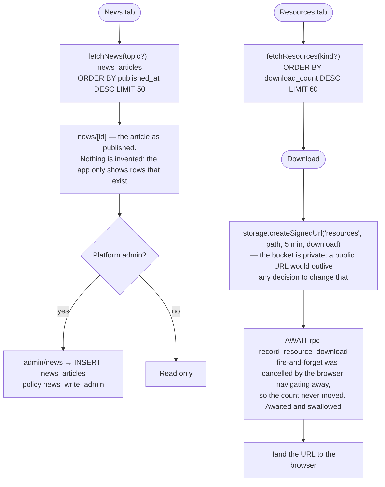
```mermaid
flowchart TD
  News(["News tab"]) --> FN["fetchNews(topic?): news_articles<br/>ORDER BY published_at DESC LIMIT 50"]
  FN --> Read["news/[id] — the article as published.<br/>Nothing is invented: the app only shows rows that exist"]
  Read --> Pub{"Platform admin?"}
  Pub -->|"yes"| Write["admin/news → INSERT news_articles<br/>policy news_write_admin"]
  Pub -->|"no"| ReadOnly["Read only"]

  Res(["Resources tab"]) --> FR["fetchResources(kind?)<br/>ORDER BY download_count DESC LIMIT 60"]
  FR --> Dl(["Download"])
  Dl --> Sign["storage.createSignedUrl('resources', path, 5 min, download)<br/>— the bucket is private; a public URL would outlive<br/>any decision to change that"]
  Sign --> Count["AWAIT rpc record_resource_download<br/>— fire-and-forget was cancelled by the browser navigating away,<br/>so the count never moved. Awaited and swallowed"]
  Count --> Give["Hand the URL to the browser"]
```

`resources` has no update policy and should not get one: a counter the client
can write is a counter anyone can inflate, and this one orders the list.

---

## 17. Trust, moderation and the platform's own queues

```mermaid
flowchart TD
  Three(["Three signals nobody can self-assert"]) --> T1["A review's moderation status"]
  Three --> T2["A school's verification"]
  Three --> T3["A teacher's TSC verification"]

  T1 --> G["BEFORE UPDATE triggers → private.guard_trust_flags()"]
  T2 --> G
  T3 --> G
  G --> Who{"auth.uid() IS NULL (service role)<br/>or private.is_platform_admin()?"}
  Who -->|"yes"| Pass["Allowed through"]
  Who -->|"no"| Which{"Which table?"}
  Which -->|"school_reviews"| E1["moderation changed → 'a review is published<br/>by a moderator, not by its author'"]
  Which -->|"profiles"| E2["tsc_verified changed → 'TSC verification is granted<br/>by the platform, not by the teacher'"]
  Which -->|"schools"| E3["verification changed → 'a school does not verify itself'"]

  Pass --> Admin(["admin/index"])
  Admin --> Am["RPC am_i_platform_admin"]
  Am --> Q["fetchQueues — three reads, all relying on the admin policies<br/>rather than any filter of their own:<br/>a non-admin gets EMPTY results, not an error"]
  Q --> Q1["Reviews where moderation = 'pending', oldest first"]
  Q --> Q2["Schools where verification IN ('pending','under_review')"]
  Q --> Q3["Profiles with a TSC number and tsc_verified = false"]
  Q1 --> A1["moderateReview → approved | rejected"]
  Q2 --> A2["setSchoolVerification"]
  Q3 --> A3["setTscVerified — which immediately changes<br/>every match score that has a TSC requirement"]
```

---

## 18. Access control — the one layer

```mermaid
flowchart TD
  Req(["Any query from the app"]) --> Anon{"Signed in?"}
  Anon -->|"no"| Public["Readable signed-out: jobs, schools, news, resources<br/>Everything else has SELECT revoked from anon outright —<br/>RLS is the second line, not the only one"]
  Anon -->|"yes"| Table{"Which table?"}

  Table -->|"profiles"| P{"Own row · discoverable ·<br/>applicant to my school · applicant to my own listing ·<br/>platform admin"}
  Table -->|"jobs"| J{"published · a school I belong to ·<br/>posted_by me · platform admin"}
  Table -->|"applications"| A{"teacher_id = me · a member of the receiving school ·<br/>private.is_job_poster — the individual who posted it"}
  Table -->|"auto_apply_rules / events"| AA["Own rows only — unreadable by any school"]
  Table -->|"saved_jobs"| SJ["Own rows only"]
  Table -->|"school_reviews"| R{"moderation = 'approved' · author_id = me · platform admin"}
  Table -->|"message_threads / messages"| M["private.is_application_participant<br/>private.is_thread_participant"]
  Table -->|"cv_*"| CV["private.may_read_cv — section 13a"]
  Table -->|"posts / comments / likes"| S["Readable by all; writable only as yourself"]

  P --> Yes(["Rows returned"])
  J --> Yes
  A --> Yes
  AA --> Yes
  SJ --> Yes
  R --> Yes
  M --> Yes
  CV --> Yes
  S --> Yes

  Yes --> Helpers["Every SECURITY DEFINER helper lives in the PRIVATE schema<br/>with a pinned search_path.<br/>PostgREST publishes everything in public as an RPC —<br/>is_school_member was callable by anyone until 0002 moved it.<br/>anon is granted EXECUTE so a signed-out read evaluates to false<br/>instead of failing the whole query with 42501"]
```

---

## 19. Lifecycle: deleting a person who has posted

```mermaid
flowchart TD
  Del(["DELETE FROM profiles"]) --> Tr["BEFORE DELETE → private.drop_unattributable_listings()"]
  Tr --> Split{"For each job they posted"}
  Split -->|"school_id IS NULL"| Kill["DELETE it — a household request whose household is gone<br/>is a dead end nobody can be contacted through"]
  Split -->|"school_id IS NOT NULL"| Keep["Keep the row; the FK sets posted_by to NULL.<br/>A school's vacancy outlives the member of staff who typed it,<br/>and jobs_attributable is still satisfied"]
  Kill --> Done
  Keep --> Done(["The delete proceeds instead of failing on 23514"])
```

---

## 20. How a change is verified

```mermaid
flowchart TD
  Change(["A change"]) --> Kind{"What kind?"}
  Kind -->|"Schema"| Mig["New file in supabase/migrations, applied to the project"]
  Mig --> Types["npm run db:types → packages/types/src/database.generated.ts"]
  Types --> Parity["parity.test.ts fails if a Postgres enum and its Zod enum drift"]
  Kind -->|"Logic"| Unit["Unit tests beside the function in packages/core"]
  Kind -->|"UI"| Guards["apps/mobile/design-guards.test.ts —<br/>three static rules the type checker cannot see,<br/>each of which has already shipped a bug"]

  Parity --> CI
  Unit --> CI
  Guards --> CI["CI on every push to main and every PR:<br/>npm install → npx tsc --noEmit → npx vitest run"]
  CI --> Green(["Green"])
```

---

## 21. The whole thing, end to end

```mermaid
flowchart LR
  subgraph T["Teacher"]
    T1["Sign up"] --> T2["Onboard: county, subjects, curricula,<br/>experience, TSC"]
    T2 --> T3["Build the CV, set its visibility"]
    T3 --> T4["Browse, filter, rank"]
    T4 --> T5["Read the school's reviews"]
    T5 --> T6["Apply — or let Auto-Apply do it"]
    T6 --> T7["Track the pipeline, message the school"]
    T7 --> T8["Review the school afterwards"]
  end

  subgraph C["@mwalimu/core"]
    C1["matchScore"]
    C2["decideAutoApply"]
    C3["filterJobs / rankJobs"]
    C4["aggregateSchoolRatings / summariseRedFlags"]
    C5["profileStrength"]
    C6["CV renderer"]
  end

  subgraph H["School or individual poster"]
    H1["Post a vacancy or a request"] --> H2["Receive applications"]
    H2 --> H3["Read the CV, where the teacher allows it"]
    H3 --> H4["Move the stage, message the teacher"]
  end

  subgraph P["Postgres"]
    P1["RLS on every table"]
    P2["set_job_provenance"]
    P3["notify_job_match"]
    P4["notify_message"]
    P5["guard_trust_flags"]
    P6["submit_school_review"]
    P7["drop_unattributable_listings"]
  end

  subgraph A["Platform"]
    A1["Moderate reviews"]
    A2["Verify schools"]
    A3["Verify TSC numbers"]
    A4["Publish news, upload resources"]
  end

  T4 --> C3
  T4 --> C1
  T6 --> C2
  T5 --> C4
  T3 --> C6
  T2 --> C5
  H1 -.-> P2
  P2 --> P3
  P3 -.-> T4
  H2 --> C1
  T7 -.-> P4
  P4 -.-> H4
  T8 -.-> P6
  P6 --> A1
  A1 --> C4
  A2 --> P5
  A3 --> P5
  A3 --> C1
  A4 --> T4
  P1 --- T
  P1 --- H
  P7 -.-> P1
```

---

## The rules the diagrams encode

1. **One matcher.** `matchScore` runs unchanged in the app, the dashboard and
   anywhere else. If the teacher and the recruiter ever saw different numbers,
   the number would be worthless.
2. **A failed must-have caps at 49**, below every Auto-Apply threshold.
3. **Auto-Apply defaults to not sending.** No advertised salary does not clear
   a salary floor; no verified institution means no automatic application; every
   skip carries a reason a teacher can read back.
4. **Frozen where it is a record, live where it is a prompt.** An application's
   match score never moves; a notification's is recomputed on read.
5. **Row Level Security is the access-control layer**, not a convenience on top
   of app checks — which is why no query in `lib/` filters by user id.
6. **Provenance is set by the database.** `posted_by` and `poster_kind` come
   from `auth.uid()` and from whether a school is attached, never from the client.
7. **Nobody asserts their own trust signal.** Moderation, school verification
   and TSC verification are all refused to the party that benefits from them.
8. **A row that will not parse is dropped and reported**, never rendered half
   empty and never silently rescored.
9. **The closed vocabularies are declared twice and tested once** — Postgres
   enums and Zod enums, with `parity.test.ts` failing on drift.
